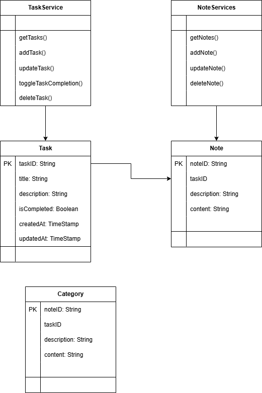

# Nhóm 02
## Thành viên của nhóm:
1. [Nguyễn Thị Phương Anh - 22010079](https://github.com/phanhh122)
2. [Nguyễn Việt Hùng - 22010323](https://github.com/ngnhonk)
3. [Phạm Quang Khải - 22010028](https://github.com/ka31504)
4. Giảng viên hướng dẫn : cô [Nguyễn Lệ Thu](https://github.com/nglthu)

# Dự án: Ứng dụng quản lý công việc Task Manager

## Giới thiệu
Task Manager là một ứng dụng quản lý công việc đơn giản, giúp người dùng tạo, chỉnh sửa, xóa và theo dõi các nhiệm vụ hàng ngày. Ứng dụng hỗ trợ đăng nhập để cá nhân hóa trải nghiệm người dùng và ghi chú nhanh bằng Sticky Notes. Đây là một công cụ hữu ích giúp người dùng tổ chức công việc một cách hiệu quả hơn

## Mục tiêu dự án
- Cung cấp một công cụ đơn giản và hiệu quả giúp người dùng quản lý công việc hàng ngày
- Hỗ trợ phân loại công việc để tăng tính tổ chức và ưu tiên
- Cải thiện trải nghiệm người dùng với giao diện thân thiện và dễ sử dụng

## Tính năng chính
- **Tạo công việc mới**: Người dùng có thể nhập tên công việc, mô tả chi tiết, thời gian thực hiện và thêm công việc vào danh sách quản lý
- **Chỉnh sửa công việc**: Người dùng có thể cập nhật thông tin công việc bất cứ lúc nào để đảm bảo thông tin chính xác
- **Xóa công việc**: Khi một công việc không còn cần thiết, người dùng có thể xóa khỏi danh sách
- **Đánh dấu hoàn thành**: Người dùng có thể đánh dấu công việc đã hoàn thành để dễ dàng theo dõi công việc
- **Ghi chú nhanh**: Cung cấp không gian để lưu trữ những thông tin quan trọng hay ý tưởng nhanh chóng mà không cần tạo công việc chi tiết
- **Sắp xếp công việc**: Người dùng có thể sắp xếp công việc theo thứ tự mong muốn như ngày tạo hay trạng thái hoàn thành của công việc, thuận tiện cho việc quản lý
- **Đăng nhập và cá nhân hóa dữ liệu**: Người dùng có thể đăng nhập để lưu trữ và đồng bộ công việc trên nhiều thiết bị
- **Lưu trữ và truy xuất dữ liệu bằng Firebase**: Dữ liệu công việc và ghi chú được lưu trữ trên Firebase Firestore, giúp người dùng truy cập mọi lúc, mọi nơi

## Structural Diagram 


## Công nghệ sử dụng
- Ngôn ngữ lập trình: Dart
- Framework: Flutter
- Cơ sở dữ liệu: Firebase Firestore

## Hướng dẫn cài đặt
1. Clone repository
   ```sh
   git clone https://github.com/ngnhonk/Nhom-02.git
   ```
2. Cài đặt dependencies
   ```sh
   flutter pub get
   ```
3. Chạy ứng dụng
   ```sh
   flutter run
   ```

## Giao diện App 
thêm giao diện 

## Hướng dẫn sử dụng
- **Thêm công việc mới**: Nhấn "Create New Task" và nhập thông tin
- **Chỉnh sửa công việc**: Nhấn biểu tượng chỉnh sửa bên cạnh công việc
- **Xóa công việc**: Nhấn biểu tượng thùng rác để xóa
- **Hoàn thành công việc**: Nhấn vào dấu tích để đánh dấu hoàn thành
- **Sắp xếp công việc**: Sử dụng "Sort by" sắp xếp theo ngày tạo, tên, trạng thái công việc
- **Sticky Notes**: Thêm các ghi chú nhanh từ giao diện chính
- **Đăng nhập để lưu công việc**: Người dùng cần đăng nhập để đồng bộ dữ liệu trên nhiều thiết bị

## Hạn chế và đề xuất cải thiện
- Thiếu chức năng nhắc nhở: Có thể thêm thông báo nhắc nhở cho công việc sắp đến hạn.
- Chưa có chế độ đồng bộ thời gian thực: Hiện tại, dữ liệu chỉ cập nhật khi tải lại trang hoặc có hành động thêm/sửa/xóa. Có thể sử dụng Firebase Realtime Database để cải thiện.


