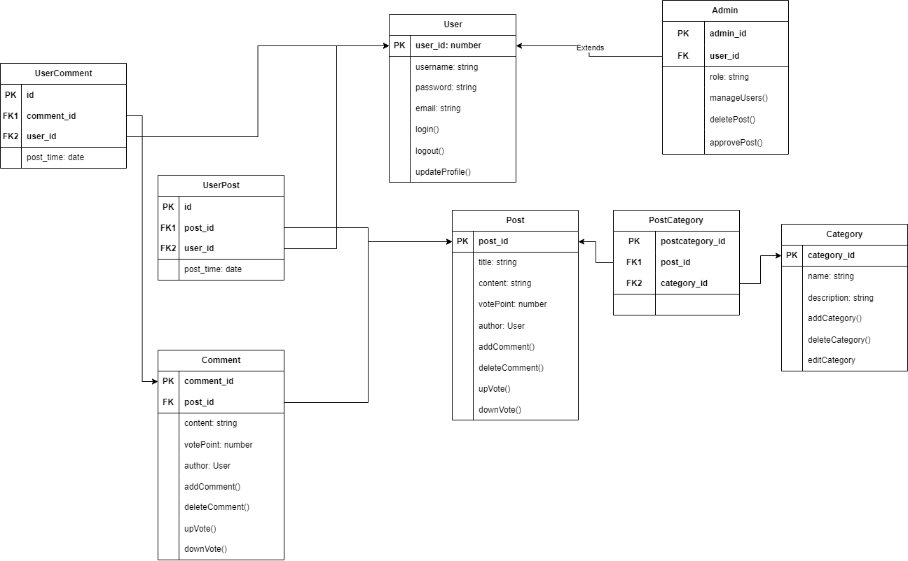

# Nhóm 02

## Thành viên của nhóm :

1. Nguyễn Thị Phương Anh - 22010079
2. Nguyễn Việt Hùng - 22010323
3. Phạm Quang Khải - 22010028
4. Giảng viên hướng dẫn : cô Nguyễn Lệ Thu

# Dự án: Hệ thống tin tức và diễn đàn trên nền tảng Mobile

## Giới thiệu
### Mục tiêu của dự án:
- Cung cấp thông tin: Xây dựng một nền tảng giúp người dùng dễ dàng truy cập các bài viết và thông tin theo các danh mục khác nhau.
- Kết nối cộng đồng: Tạo diễn đàn cho phép người dùng đăng bài viết, bình luận, và tương tác với các nội dung của nhau.
- Quản lý và duy trì: Cho phép admin quản lý nội dung bài viết, phân loại danh mục, và thực hiện các tác vụ quản trị hệ thống.
### Chức năng chính:
#### 1. Quản lý người dùng:
- Người dùng có thể đăng ký, đăng nhập, và cập nhật hồ sơ cá nhân.
- Hỗ trợ phân quyền giữa User và Admin để quản lý hệ thống.
#### 2. Quản lý bài viết (Post):
- Người dùng có thể tạo bài viết, chỉnh sửa nội dung và xóa bài viết của mình.
- Mỗi bài viết được liên kết với danh mục (Category) để phân loại dễ dàng.
#### 3. Quản lý danh mục (Category):
- Admin có thể thêm, chỉnh sửa, hoặc xóa danh mục.
- Mỗi danh mục chứa các bài viết thuộc về chủ đề cụ thể.
#### 4. Tương tác bài viết và bình luận (Post và Comment):
- Người dùng có thể bình luận dưới các bài viết, thêm điểm đánh giá (upvote/downvote) và trả lời bình luận của người khác.
#### 5. Quản lý mối quan hệ giữa người dùng và nội dung (UserPost, UserComment):
- Theo dõi thời gian người dùng đăng bài hoặc bình luận để tạo lịch sử hoạt động.
#### 6. Phân loại bài viết và danh mục (PostCategory):
- Hỗ trợ liên kết bài viết với nhiều danh mục, phục vụ tìm kiếm và tổ chức nội dung.

## Sơ đồ UML:

