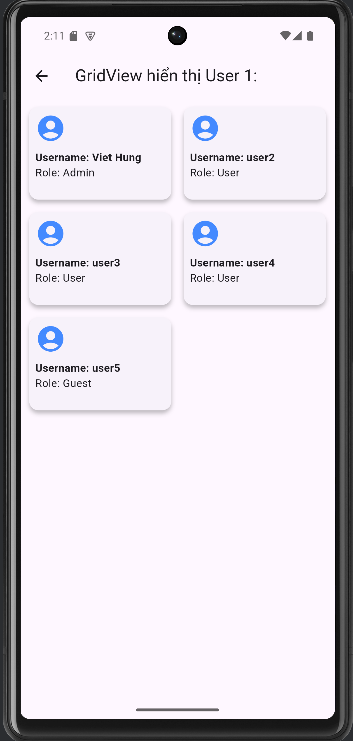
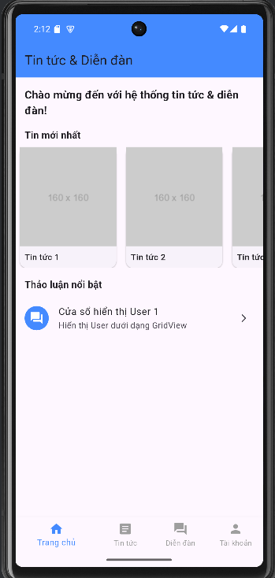

## Class User

1. Định nghĩa `class User` theo yêu cầu của đề bài, bao gồm: `username`, `password`, và `role`.
```markdown
```dart
class User {
  String username;
  String password;
  String role;

  User(this.username, this.password, this.role);
}
```
2. Khởi tạo danh sách các User thông qua:
   ```dart
   final List<User> users = [
     User('Viet Hung', 'pass1', 'Admin'),
     User('user2', 'pass2', 'User'),
     User('user3', 'pass3', 'User'),
     User('user4', 'pass4', 'User'),
     User('user5', 'pass5', 'Guest'),
   ];
   ```

## Class ForumDetailScreen

1. `ForumDetailScreen` là một `StatelessWidget` để tạo layout hiển thị thông tin của các User với `GridView`.  
   Các thông số của `GridView`:
   ```dart
   gridDelegate: const SliverGridDelegateWithFixedCrossAxisCount(
     crossAxisCount: 2, // Số cột
     crossAxisSpacing: 8.0, // Khoảng cách giữa các cột
     mainAxisSpacing: 8.0, // Khoảng cách giữa các hàng
     childAspectRatio: 3 / 2, // Tỉ lệ chiều rộng và chiều cao
   )
   ```

2. Hiển thị thông tin User:
   ```dart
   Text('Username: ${user.username}'),
   Text('Role: ${user.role}'),
   ```

3. Icon đại diện cho User:
   ```dart
   Icon(
     Icons.account_circle,
     size: 40,
     color: Colors.blueAccent,
   )
   ```

## main.dart

1. Class `HomeScreen` được xây dựng để dẫn tới các `ForumDetailScreen` với ID tăng dần.  
   Tuy nhiên, phần này đã được sửa đổi để `itemCount = 1`, hiển thị duy nhất một phần tại trang chủ.  

2. Khi nhấn vào `"Cửa sổ hiển thị User 1"`, ứng dụng sẽ điều hướng đến `ForumDetailScreen`.

## Hình ảnh

### Grid View
  


## Các phần code chính

### Class User
```dart
class User {
  String username;
  String password;
  String role;

  User(this.username, this.password, this.role);
}
```

### ForumDetailScreen
```dart
class ForumDetailScreen extends StatelessWidget {
  final int forumId;

  const ForumDetailScreen({super.key, required this.forumId});

  @override
  Widget build(BuildContext context) {
    return Scaffold(
      appBar: AppBar(
        title: Text('GridView hiển thị User $forumId:'),
      ),
      body: Padding(
        padding: const EdgeInsets.all(8.0),
        child: GridView.builder(
          gridDelegate: const SliverGridDelegateWithFixedCrossAxisCount(
            crossAxisCount: 2,
            crossAxisSpacing: 8.0,
            mainAxisSpacing: 8.0,
            childAspectRatio: 3 / 2,
          ),
          itemCount: users.length,
          itemBuilder: (context, index) {
            final user = users[index];
            return Card(
              elevation: 4.0,
              child: Padding(
                padding: const EdgeInsets.all(8.0),
                child: Column(
                  crossAxisAlignment: CrossAxisAlignment.start,
                  children: [
                    Icon(
                      Icons.account_circle,
                      size: 40,
                      color: Colors.blueAccent,
                    ),
                    const SizedBox(height: 8),
                    Text(
                      'Username: ${user.username}',
                      style: const TextStyle(
                        fontWeight: FontWeight.bold,
                      ),
                    ),
                    Text('Role: ${user.role}'),
                  ],
                ),
              ),
            );
          },
        ),
      ),
    );
  }
}
```

### HomeScreen
```dart
class HomeScreen extends StatelessWidget {
  const HomeScreen({super.key});

  @override
  Widget build(BuildContext context) {
    return SingleChildScrollView(
      child: Column(
        crossAxisAlignment: CrossAxisAlignment.start,
        children: [
          const Padding(
            padding: EdgeInsets.all(16.0),
            child: Text(
              'Chào mừng đến với hệ thống tin tức & diễn đàn!',
              style: TextStyle(
                fontSize: 18,
                fontWeight: FontWeight.bold,
              ),
            ),
          ),
          const Padding(
            padding: EdgeInsets.symmetric(horizontal: 16.0),
            child: Text(
              'Tin mới nhất',
              style: TextStyle(
                fontSize: 16,
                fontWeight: FontWeight.w600,
              ),
            ),
          ),
          const SizedBox(height: 8),
          SizedBox(
            height: 200,
            child: ListView.builder(
              scrollDirection: Axis.horizontal,
              itemCount: 5,
              itemBuilder: (context, index) {
                return GestureDetector(
                  onTap: () {
                    Navigator.push(
                      context,
                      MaterialPageRoute(
                        builder: (context) =>
                            NewsDetailScreen(newsId: index + 1),
                      ),
                    );
                  },
                  child: Card(
                    margin: const EdgeInsets.symmetric(horizontal: 8),
                    child: SizedBox(
                      width: 160,
                      child: Column(
                        crossAxisAlignment: CrossAxisAlignment.start,
                        children: [
                          Expanded(
                            child: Image.network(
                              'https://via.placeholder.com/160',
                              fit: BoxFit.cover,
                              width: double.infinity,
                            ),
                          ),
                          Padding(
                            padding: const EdgeInsets.all(8.0),
                            child: Text(
                              'Tin tức ${index + 1}',
                              style: const TextStyle(
                                  fontSize: 14, fontWeight: FontWeight.w500),
                            ),
                          ),
                        ],
                      ),
                    ),
                  ),
                );
              },
            ),
          ),
          const SizedBox(height: 16),
          const Padding(
            padding: EdgeInsets.symmetric(horizontal: 16.0),
            child: Text(
              'Thảo luận nổi bật',
              style: TextStyle(
                fontSize: 16,
                fontWeight: FontWeight.w600,
              ),
            ),
          ),
          const SizedBox(height: 8),
          ListView.builder(
            physics: const NeverScrollableScrollPhysics(),
            shrinkWrap: true,
            itemCount: 1,
            itemBuilder: (context, index) {
              return ListTile(
                leading: const CircleAvatar(
                  backgroundColor: Colors.blueAccent,
                  child: Icon(Icons.forum, color: Colors.white),
                ),
                title: Text('Cửa sổ hiển thị User ${index + 1}'),
                subtitle: const Text('Hiển thị User dưới dạng GridView'),
                trailing: const Icon(Icons.arrow_forward_ios, size: 16),
                onTap: () {
                  Navigator.push(
                    context,
                    MaterialPageRoute(
                      builder: (context) =>
                          ForumDetailScreen(forumId: index + 1),
                    ),
                  );
                },
              );
            },
          ),
        ],
      ),
    );
  }
}
```
``` 
